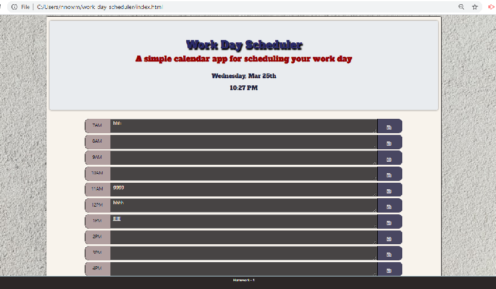
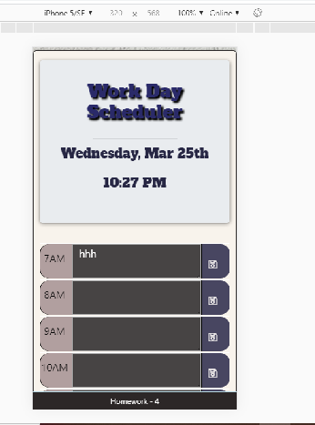

# Work Day Scheduler

# jquery
## Work Day Scheduler is awebsite that is having a day calender  with current Date and time on top  and userrs can save event according to  time.The page ues feature by dynamically updated HTML and CSS powered by JavaScript code and jqueryize site and for date and time uses moment js

## View THis Page 
[Workday Scheduler](https://rumardas.github.io/work_day_scheduler/)

## Application Uses in this Projects
* Javascript
* jquery
* Bootstrap
* Html
* CSS

## Day planner overview
* Page is showing 9am to 5pm event rows.
* Users can input events on according to time
* And Users needs to click save button to save the events
* If Users want to delet any event needs to delet the event and click save button
* Current time row will background is #72d37f color and text red.
* Future time row will background is #f8f3b1 color and text black.
* Past time row will background is #474444 color and text white.

## Pages  view
## Desktop View

## Ipad View

## Iphone View

## Font Decoration 

* For font decoration uses I used google font 
* link for that [https://fonts.googleapis.com/css?family=Bangers]
* For Time and date used moment js
* link for that [https://momentjs.com/]

## Attribution
*[https://stackoverflow.com]
*[https://getbootstrap.com/docs/]
*[https://www.w3schools.com/bootstrap4/default.asp]