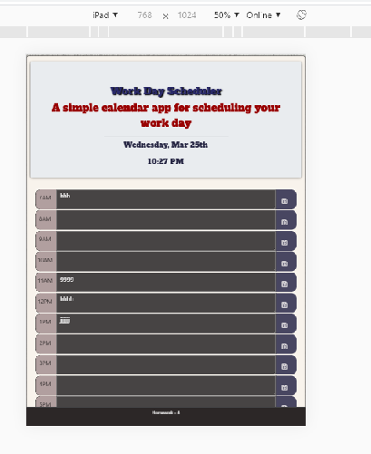

# Work Day Scheduler
## View This Page [ ]
# jquery
## Work Day Scheduler is awebsite that is having a day calender  with current Date and time on top  and userrs can save event according to  time.The page ues feature by dynamically updated HTML and CSS powered by JavaScript code and jqueryize site and for date and time uses moment js.

## View THis Page [Workday Scheduler ] (https://rumardas.github.io/work_day_scheduler/)

## Application Uses in this Projects
* Javascript
* jquery
* Bootstrap
* Html
* CSS

## calender overview

## Pages  view
## Desktop View

## Ipad View

## Iphone View

## Font Decoration 

* For font decoration uses I used google font 
* link for that [https://fonts.googleapis.com/css?family=Bangers]
* For Time and date used moment js
* link for that [https://momentjs.com/]

## Attribution
*[https://stackoverflow.com]
*[https://getbootstrap.com/docs/]
*[https://www.w3schools.com/bootstrap4/default.asp]